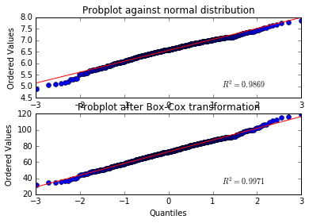

### skutil
A succinct set of [sklearn](https://github.com/scikit-learn/scikit-learn) extension classes.  


#### Installation:
```bash
git clone https://github.com/tgsmith61591/skutil.git
cd skutil
python setup.py install
```


#### Encoders
Currently implemented encoders:
- `OneHotCategoricalEncoder`:
  - Should be the first phase in your `Pipeline` object. Takes a Pandas dataframe, imputes missing categorical data with a provided string and dummies out the object (string) columns. Finally, returns a `numpy.ndarray` transformed array.
- `SafeLabelEncoder`:
  - Wraps sklearn's `LabelEncoder`, but encodes unseen data in your test set as a default factor-level value (99999).

```python
## Example use of OneHotCategoricalEncoder
import numpy as np
from skutil.preprocessing import SafeLabelEncoder, OneHotCategoricalEncoder
import pandas as pd

## An array of strings
X = np.array([['USA','RED','a'],
              ['MEX','GRN','b'],
              ['FRA','RED','b']])
x = pd.DataFrame.from_records(data = X, columns = ['A','B','C'])

## Tack on a numeric col:
x['n'] = np.array([5,6,7])

## Fit the encoder -- default return is pandas DataFrame
o = OneHotCategoricalEncoder(as_df=False).fit(x)

## Notice that the numeric data is now BEFORE the dummies
>>> o.transform(x)
[[ 5.,  0.,  0.,  1.,  0.,  0.,  1.,  0.,  1.,  0.,  0.],
 [ 6.,  0.,  1.,  0.,  0.,  1.,  0.,  0.,  0.,  1.,  0.],
 [ 7.,  1.,  0.,  0.,  0.,  0.,  1.,  0.,  0.,  1.,  0.]]

## We can extract the new names:
>>> o.trans_nms_
['n', 'A.0', 'A.1', 'A.2', 'A.NA', 'B.0', 'B.1', 'B.NA', 'C.0', 'C.1', 'C.NA']

## Notice we have one extra factor level for each column (i.e., 'A.NA').
## This is to hold factor levels in testing that we didn't see in training.
## Most sklearn algorithms will shrink that coefficient to zero in training,
## or completely ignore it so it's merely a placeholder for elegant handling
## of new data. Let's test what happens on unseen data: 
Y = np.array([['CAN','BLU','c']])
y = pd.DataFrame.from_records(data = Y, columns = ['A','B','C'])

## Add the numeric var in at the end
y['n'] = np.array([7])
>>> o.transform(y)
[[ 7.,  0.,  0.,  0.,  1.,  0.,  0.,  1.,  0.,  0.,  1.]]

## Notice only the 'x.NA' features are populated!
```


#### Transformers
Currently implemented `TransformerMixin` classes:
- `BoxCoxTransformer`
  - Will ignore sparse dummy columns produced by Encoder classes
- `YeoJohnsonTransformer`
  - Will ignore sparse dummy columns produced by Encoder classes
- `SpatialSignTransformer`
- `SelectiveImputer`
- `SelectivePCA`
- `SelectiveScaler`

All transformers in skutil will take the arg `cols=None` (None being the default, which will automatically use all columns), which allows transformers to operate only on a subset of columns rather than the entire matrix.


```python
## Example using BoxCoxTransformer
import pandas as pd
from skutil.preprocessing import BoxCoxTransformer
from scipy import stats

## Create a matrix of two-columns
X = np.array([stats.loggamma.rvs(5, size=500) + 5,
              stats.loggamma.rvs(5, size=500) + 5]).transpose()

fig = plt.figure()
ax1 = fig.add_subplot(211)
prob = stats.probplot(X[:,0], dist=stats.norm, plot=ax1)
ax1.set_xlabel('')
ax1.set_title('Probplot against normal distribution')

Xdf = pd.DataFrame.from_records(data=X)
transformer = BoxCoxTransformer(as_df=False).fit(Xdf)
ax2 = fig.add_subplot(212)
prob = stats.probplot(transformer.transform(Xdf)[:,0], dist=stats.norm, plot=ax2)
ax2.set_title('Probplot after Box-Cox transformation')
```


